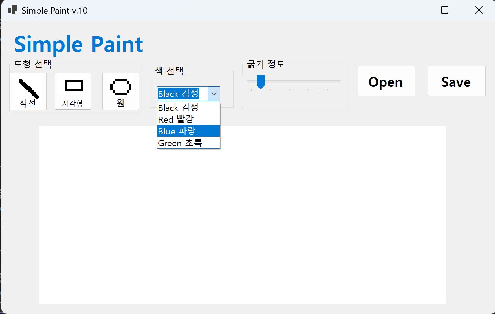
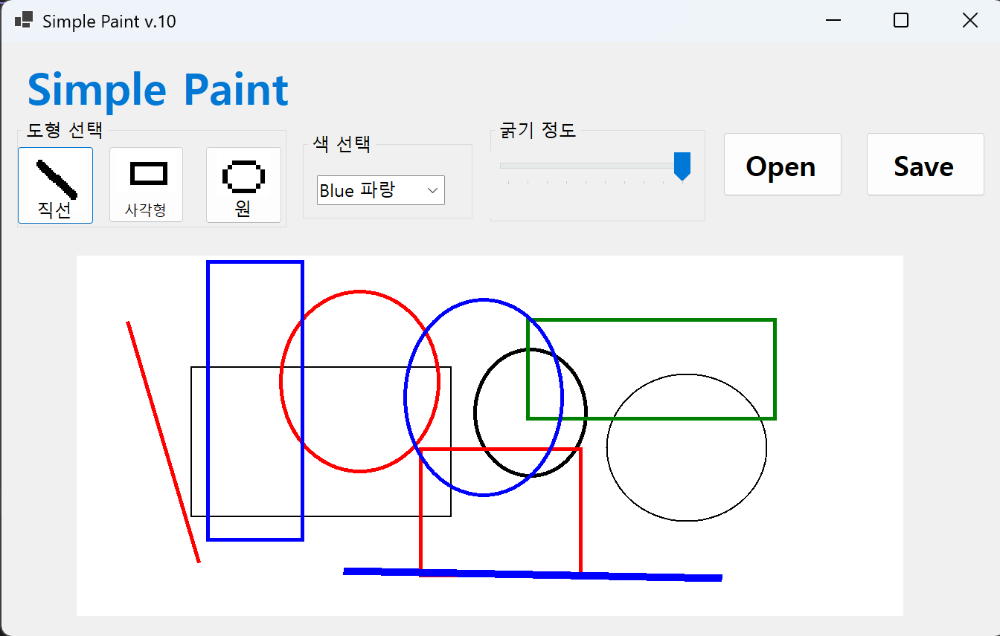
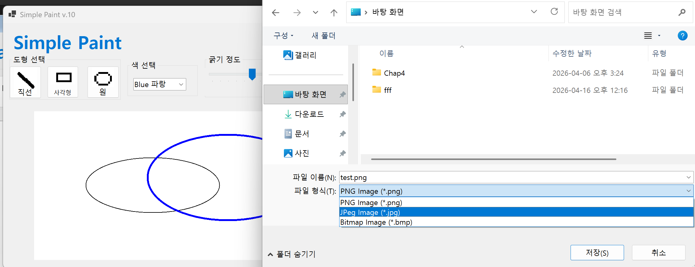
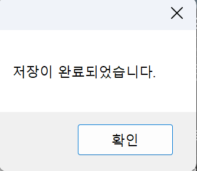
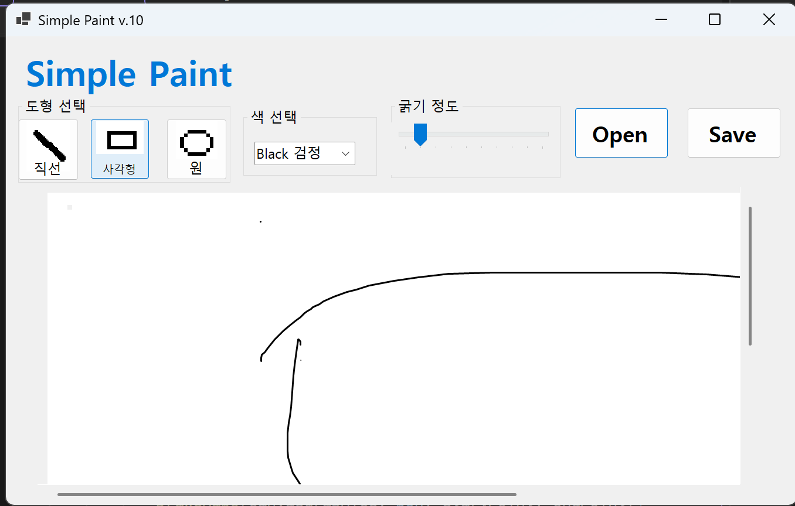
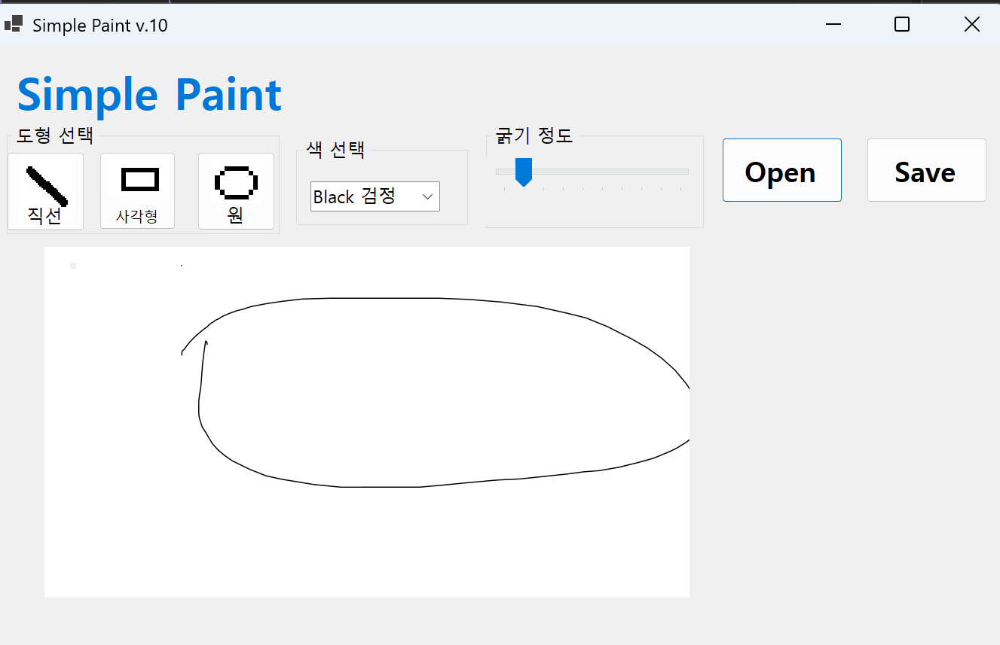

# (C# 코딩) SimplePaint 

## 개요
- C# 프로그래밍 학습
- 1줄 소개: 사용자가 도형과 색상, 선 두께를 선택하여 자유롭게 그림을 그릴 수 있는 윈도우 폼 기반 그림판 프로그램
- 사용한 플랫폼: 
  - C#, .NET Windows Forms, Visual Studio, GitHub
- 사용한 컨트롤: 
  - Label, Button, ComboBox, TrackBar, PictureBox, GroupBox
- 사용한 기술과 구현한 기능:
  - Visual Studio를 이용하여 UI 디자인
  - Bitmap 클래스를 이용한 메모리 기반 캔버스 생성
  - Graphics 객체를 활용한 그리기 도구 구현
  - ComboBox와 TrackBar를 활용한 사용자 설정 연동

## 실행 화면 (과제1)
- 코드의 실행 스크린샷과 구현 내용 설명
  
  
- 구현한 내용 (위 그림 참조)
  - GroupBox를 사용하여 도형 선택(직선, 사각형, 원)과 색상 및 선 두께 설정을 시각적으로 그룹화함
    `private GroupBox gpDiagram; `
  - ComboBox에 색상 항목을 추가하고 SelectedIndexChanged 이벤트를 통해 선택한 색상을 currentColor 변수에 저장함
    ` switch (cmbColor.SelectedIndex){}`
  - TrackBar의 범위를 1에서 10으로 설정하여 사용자가 슬라이더를 움직일 때마다 currentLineWidth 값을 갱신하도록 구현함    
     `if (cmbColor.SelectedIndex == 0) { currentColor = Color.Black; } currentLineWidth = trbLineWidth.Value; `

## 실행 화면 (과제2)
- 코드의 실행 스크린샷과 구현 내용 설명 
  
  

- 구현한 내용 (위 그림 참조)
  - MouseDown 이벤트에서 드래그 시작점(startPoint)을 저장하고, MouseUp 이벤트에서 최종 위치(endPoint)를 받아 도형 생성을 확정함
    ` startPoint = new Point((int)(e.X / zoomScale), (int)(e.Y / zoomScale));`
  - GetRectangle 함수를 구현하여 마우스를 어느 방향으로 드래그하더라도 항상 올바른 사각형 영역(좌상단 좌표 및 가로/세로 길이)이 계산되도록 처리함
    `DrawShape(e.Graphics, previewPen, startPoint, endPoint); `
  - Pen 객체에 앞서 설정한 currentColor와 currentLineWidth를 적용하여 사용자가 지정한 스타일로 비트맵에 직접 그림을 그림          
    `if (isDrawing) { DrawShape(canvasGraphics, pen, startPoint, endPoint); } picCanvas.Invalidate();`

## 실행 화면 (과제3)
- 코드의 실행 스크린샷과 구현 내용 설명
  
  
  

- 구현한 내용 (위 그림 참조)
  - SaveFileDialog의 Filter 속성을 설정하여 사용자가 원하는 확장자를 선택할 수 있도록 구현함
   ` saveFileDialog.Filter = "PNG Image|*.png|JPeg Image|*.jpg|Bitmap Image|*.bmp";`
  - Bitmap.Save() 메서드를 사용하여 현재 캔버스(canvasBitmap)의 데이터를 실제 파일로 변환하여 저장함
    `canvasBitmap.Save(fileName, System.Drawing.Imaging.ImageFormat.{type})`
  - 파일명의 끝자리를 확인하여 선택한 포맷에 맞는 ImageFormat(Png, Jpeg, Bmp)을 적용하는 로직을 작성함     
    `if (saveFileDialog.ShowDialog() == DialogResult.OK) { canvasBitmap.Save(fileName, format); }`
## 실행 화면 (과제4)
- 코드의 실행 스크린샷과 구현 내용 설명
  
  
  
- 구현한 내용 (위 그림 참조)
  - OpenFileDialog로 선택한 이미지에서 Bitmap을 생성하여 canvasBitmap을 초기화하고, PictureBox의 Size를 이미지 원본 크기와 동기화함
    `Image loadedImage = Image.FromFile(openFileDialog.FileName)`
  - PictureBox의 SizeMode를 Zoom으로 설정하고, zoomScale 변수를 활용하여 Control+마우스 휠 조작 시 실시간으로 배율을 조정함
    `picCanvas.Width = (int)(canvasBitmap.Width * zoomScale);`
  - 확대된 상태에서 마우스 좌표가 어긋나지 않도록 `(int)(e.X / zoomScale)` 공식을 사용하여 이미지상의 실제 픽셀 좌표를 계산함
  - HandledMouseEventArgs를 사용하여 확대/축소 시 패널의 기본 스크롤 동작이 간섭하지 않도록 제어 로직을 구현함
    `picCanvas.Width = (int)(canvasBitmap.Width * zoomScale); picCanvas.Invalidate();`